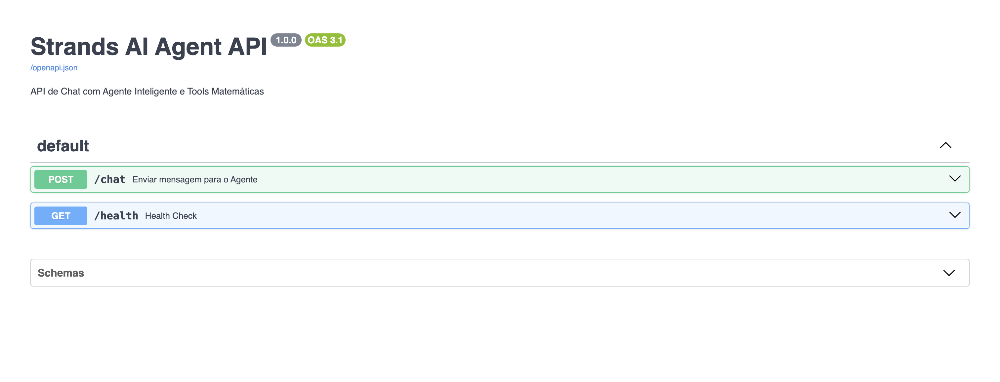
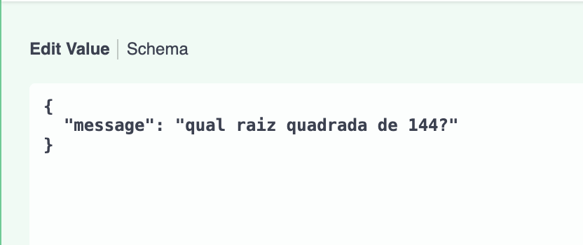
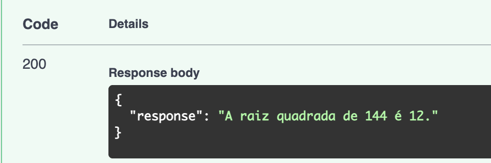

# Strands AI Agent API 🤖

Uma API RESTful robusta construída com **FastAPI** que orquestra um Agente de Inteligência Artificial capaz de realizar conversação natural e executar ferramentas matemáticas (Function Calling).

Este projeto foi desenvolvido com foco em **Arquitetura Limpa**, **Baixo Acoplamento** e **Design Patterns** para integração com LLMs locais via Ollama.

## 🏗 Arquitetura e Decisões Técnicas

### 1. Design Pattern: Service Layer & Dependency Injection
A aplicação segue uma separação clara de responsabilidades:
- **API Layer (`app/api`)**: Responsável apenas pela validação de entrada (Pydantic) e gestão de rotas HTTP.
- **Service Layer (`app/agents`)**: Encapsula a lógica de negócio do Agente, isolando o controlador de detalhes da implementação da IA.
- **Tools Layer (`app/tools`)**: Módulos puros e testáveis que contêm as funcionalidades executadas pelo agente.

### 2. Estratégia de Mocking e Resiliência
Devido à natureza restrita do SDK `strands-agents` (simulação de ambiente privado), foi implementada uma **Camada de Adaptação (Adapter Pattern)**:
- O sistema detecta automaticamente a ausência da biblioteca oficial.
- Injeta classes **Mock (Stub)** que emulam o comportamento do SDK.
- Utiliza uma heurística local para decidir entre chamar a Tool de Cálculo ou o LLM (Ollama) diretamente via API REST.
**Resultado:** O projeto é 100% funcional em qualquer ambiente local, sem dependências quebradas.

### 3. Segurança na Execução de Código
A *Math Tool* utiliza `eval()`, mas implementa uma camada de **Sanitização Estrita** (Allowlist) que rejeita qualquer caractere que não seja numérico ou operador básico, mitigando riscos de *Code Injection*.

---

## 🚀 Como Executar

### Pré-requisitos
- **Python 3.10+**
- **Ollama** instalado e rodando localmente.

### 1. Configuração do Ambiente
Clone o repositório e instale as dependências:

```bash
  # Criar e ativar ambiente virtual
python -m venv .venv
source .venv/bin/activate  # Linux/Mac
.venv\Scripts\activate   # Windows

# Instalar pacotes
pip install -r requirements.txt
```

### 2. Configuração do Modelo (LLM)
#### Crie um arquivo .env na raiz do projeto (baseado nas configurações do seu Ollama local):

```TOML
OLLAMA_BASE_URL=http://localhost:11434
OLLAMA_MODEL=llama3:latest

# Certifique-se de ter o modelo baixado: ollama pull llama3
```

### 3. Inicializar a API

```Bash                                         
  uvicorn app.main:app --reload
```
#### Acesse a documentação interativa (Swagger UI) em: http://127.0.0.1:8000/docs

---

## 📸 Demonstração e Uso

### Swagger - http://127.0.0.1:8000/docs
### Utilize o método POST /chat, clique em Try it out e insira seu JSON.


### Exemplo Pergunta


### Exemplo Resposta


---

## 🧪 Testando os Endpoints

### Chat Geral

POST /chat

```JSON
{
  "message": "Olá, qual é a capital de Portugal?"
}
```

### Teste de Ferramenta (Cálculo)
#### O agente identificará automaticamente a necessidade de cálculo. POST /chat

```JSON
{
  "message": "Quanto é 1234 * 5678?"
}
```

---

## 💻 Interface Web (Opcional)

Para uma experiência mais amigável, o projeto inclui um frontend interativo desenvolvido com Streamlit.
Mantenha a API rodando em um terminal (uvicorn app.main:app --reload).

Abra um novo terminal e execute:

```Bash
  streamlit run frontend.py
```
A interface abrirá automaticamente no seu navegador padrão.

---

## 📂 Estrutura do Projeto
```Plaintext
.
├── app/                      # Backend (FastAPI & Agentes)
│   ├── agents/
│   │   ├── __init__.py
│   │   └── core_agent.py     # Service Layer (Lógica do Agente e Mock Adapter)
│   ├── api/
│   │   ├── __init__.py
│   │   ├── routes.py         # Controllers (Definição dos Endpoints)
│   │   └── schemas.py        # DTOs (Pydantic Models)
│   ├── tools/
│   │   ├── __init__.py
│   │   └── math_tools.py     # Domain Logic (Ferramentas e Sanitização)
│   ├── __init__.py
│   └── main.py               # Application Entrypoint (Server Config)
├── assets/                   # Imagens da documentação
├── frontend.py               # Interface Gráfica (Streamlit)
├── .env                      # Variáveis de Ambiente (Configuração Local)
├── .gitignore                # Regras de ignorância do Git
├── requirements.txt          # Dependências do Projeto
└── README.md                 # Documentação do Projeto
```
